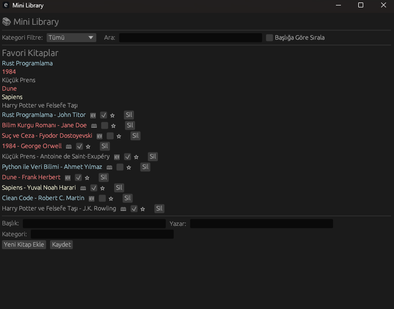

# 📚 Mini Library

Rust ile yazılmış, egui tabanlı masaüstü kütüphane yönetim uygulaması.



---

## Özellikler

- 📖 Kitap ekleme, silme
- 🎨 Renkli kategori etiketleri (Programlama, Roman, Bilim, Tarih, Diğer)
- ⭐ Favori kitaplar paneli
- ✅ Okundu/okunmadı takibi
- ★ 1–5 yıldız puanlama sistemi
- 📝 Kitap başına not alanı
- 🔍 Başlık ve yazar arama
- 🗂️ Kategori filtreleme
- 🔤 Başlığa göre sıralama
- 📊 İstatistik bar (toplam kitap, okundu, favori sayısı)
- 💾 JSON tabanlı yerel kayıt

---

## Kurulum

### Windows

1. `MiniLibrarySetup.exe` dosyasını çalıştırın.
2. Kurulum tamamlandıktan sonra Başlat menüsünden **Mini Library**'yi açın.

### Linux

```bash
./library_gui.AppImage
```

---

## Build (Kaynak Koddan)

### Gereksinimler

- [Rust](https://rustup.rs/) (stable)
- Windows hedefi için: `mingw-w64`

### Windows EXE (WSL üzerinden)

```bash
rustup target add x86_64-pc-windows-gnu
cargo build --release --target x86_64-pc-windows-gnu
cp target/x86_64-pc-windows-gnu/release/mini-library.exe target/release/mini-library.exe
```

### Installer oluşturma (Windows PowerShell)

```powershell
$inno = "${env:ProgramFiles(x86)}\Inno Setup 6\ISCC.exe"
& "$inno" "installer.iss"
```

---

## Proje Yapısı

```
MiniLibrary/
├── src/
│   ├── main.rs       # Uygulama giriş noktası
│   ├── book.rs       # Book struct, kategori renkleri
│   ├── library.rs    # Kitap listesi, JSON kayıt/yükleme
│   └── ui.rs         # egui arayüzü
├── covers/
│   └── default.jpg   # Varsayılan kapak görseli
├── screenshots/
│   └── preview.png   # README görseli
├── library.json      # Kitap verisi (otomatik oluşur)
├── installer.iss     # Inno Setup yapılandırması
└── Cargo.toml
```

---
